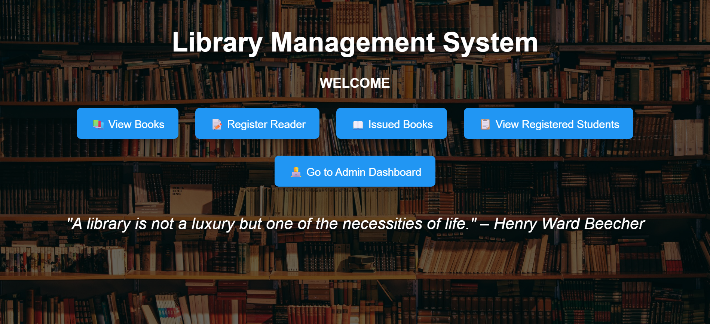
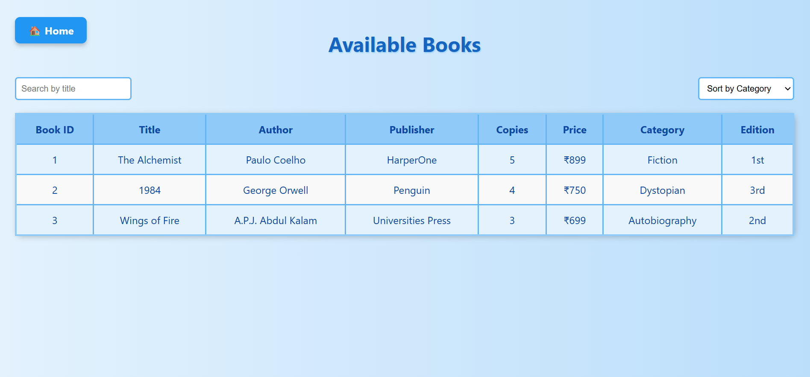
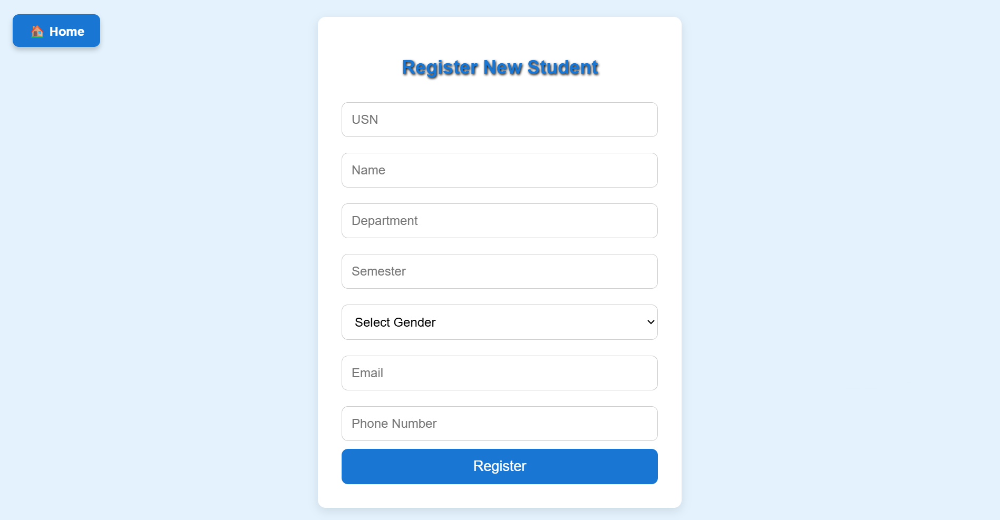
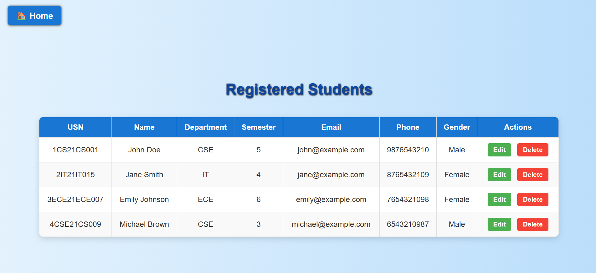
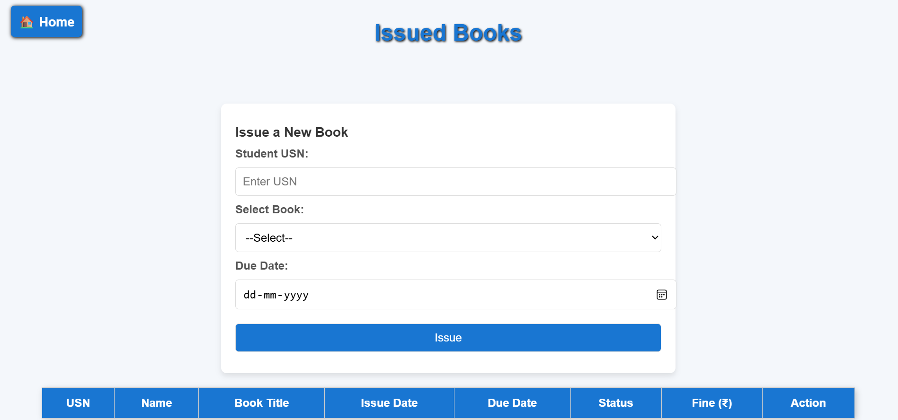
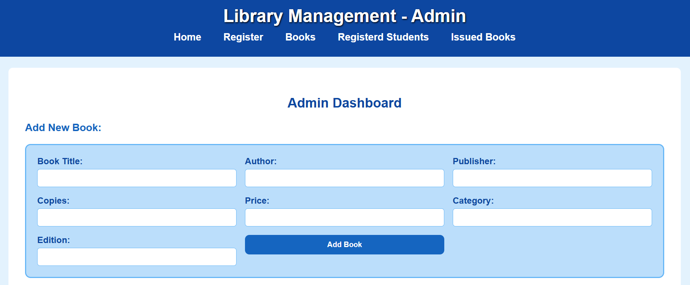
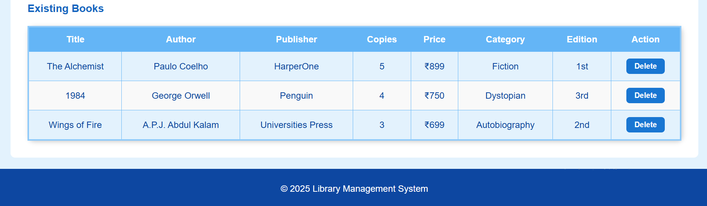

# Library Management System

## About the Project
Library Management System is a web-based application designed to simplify the management of books, students, and issued books in a library.
The system provides separate interfaces for managing library resources, registering students, viewing student records, and tracking issued books.
The project demonstrates the use of frontend web technologies along with a Node.js backend and database integration.

## Features
- View available books
- Search books
- Filter books by category
- Add and manage books
- Register students
- View registered students
- Edit student information
- Delete student records
- View issued books
- Admin management interface
- Backend API integration
- Database connectivity
- Responsive user interface

## Technologies Used
### Frontend
- HTML5
- CSS3
- JavaScript

### Backend
- Node.js
- Express.js

### Database
- MySQL

### Tools
- Visual Studio Code
- Git
- GitHub

## Screenshots
### Home Page

### Books

### Student Registration

### Students

### Issued Books

### Admin Dashboard

## Project Modules
### 1. Home Page
Provides an overview of the library management system and navigation to the different sections of the application.

### 2. Book Management
Allows users/admins to view and manage books available in the library.

### 3. Student Registration
Provides a form for registering new students/readers.

### 4. Student Management
Displays registered students and provides options for managing student information.

### 5. Issued Books
Displays information about books that have been issued to students.

### 6. Admin Panel
Provides administrative functionality for managing library data.

## System Architecture
The application follows a client-server architecture.

User
↓
HTML / CSS / JavaScript
↓
Frontend
↓
Node.js + Express.js
↓
MySQL Database

The frontend provides the user interface, while the Node.js and Express.js backend handles server-side operations and communication with the database.

## Database
The system uses MySQL for storing library-related information.
Main entities include:
- Books -- Stores information about books.
- Readers -- Stores registered student/reader information.
- Borrow Records -- Stores book issue/borrowing records.

## How to Run the Project
### Prerequisites
Make sure the following are installed:
- Node.js
- npm
- MySQL
- Web browser

### Backend Setup
Navigate to the backend directory:
cd backend
Install the required dependencies: npm install
Start the server: node server.js
--The backend will start on the configured port.
Frontend: Open index.html in a web browser or run the project using a local development server.

## Objectives
- To computerize basic library management activities.
- To maintain book information digitally.
- To simplify student registration and management.
- To track issued books.
- To reduce manual record keeping.
- To provide a simple and user-friendly interface.
- To demonstrate frontend, backend, and database integration.

## Advantages
- Reduces manual record keeping.
- Provides faster access to library information.
- Makes book management easier.
- Simplifies student registration.
- Provides centralized access to library records.
- Improves organization of borrowing information.
- Provides a user-friendly web interface.

## Limitations
- Authentication and authorization are limited.
- The system is primarily designed for local use.
- Advanced reporting functionality is not included.
- Email/SMS notifications are not implemented.
- The current version does not provide a deployed cloud environment.

## Future Scope
The project can be extended with:
- User authentication
- Admin authentication
- Role-based access control
- Book return management
- Due-date tracking
- Automatic overdue detection
- Email notifications
- Advanced search
- Library analytics
- Fine calculation
- Cloud deployment
- Mobile-friendly improvements

## Learning Outcomes
Through this project, the following concepts were practiced:
- HTML page development
- CSS styling and responsive design
- JavaScript DOM manipulation
- Form handling and validation
- Client-server communication
- REST API development
- Node.js and Express.js
- MySQL database integration
- CRUD operations
- Git and GitHub project management

## Table of Contents
- [About the Project](#about-the-project)
- [Features](#features)
- [Technologies Used](#technologies-used)
- [Project Modules](#project-modules)
- [System Architecture](#system-architecture)
- [Database](#database)
- [API Endpoints](#api-endpoints)
- [Screenshots](#screenshots)
- [Installation](#installation)
- [Objectives](#objectives)
- [Advantages](#advantages)
- [Limitations](#limitations)
- [Future Scope](#future-scope)
- [Learning Outcomes](#learning-outcomes)
